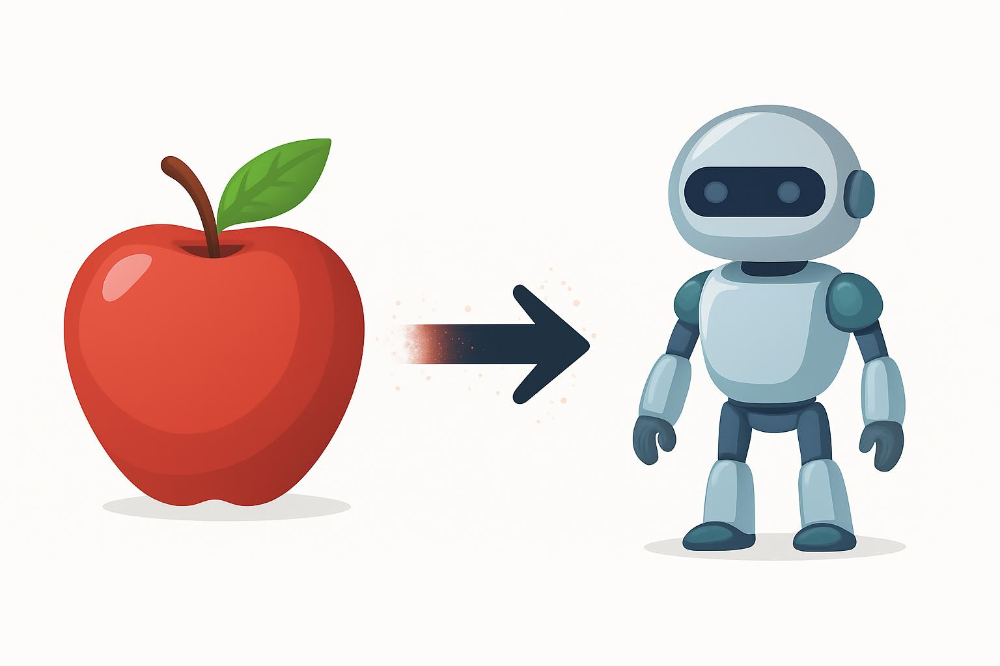

## About
When downloading photos from iCloud, all Live Photos (images that move for ~3 seconds) are exported as two separate files: one static image and one short video. If you have thousands of photos, this quickly becomes very annoying.

If you're migrating away from Apple and want to keep your Live Photos *alive*, this repo is for you.

**apples2droids** converts Apple Live Photos into a single Motion Photo `.jpg` that is compatible with Google Motion Photos and other Android devices. The output is **one file per photo**, not a split image + video pair.

The resulting `.jpg` remains a Motion Photo, but its motion component is only accessible on compatible devices (e.g. Android). Copying or saving the file elsewhere will **not** strip its motion data.

**NOTE**: This tool assumes Live Photos are exported as one image file and one video file with identical names (e.g. `IMG_0001.HEIC` + `IMG_0001.MOV`), which is the standard iCloud export format. If filenames do not match, they will not be paired.


## Quick Start
You need Python. Create a virtual environment, then run:

```bash
pip install -r requirements.txt
```

**NOTE**: ExifTool and ffmpeg are required and must be available in PATH. Download ExifTool here: [Website](https://exiftool.org/).

### Windows:

Download ExifTool directly: [Windows 64](https://sourceforge.net/projects/exiftool/files/exiftool-13.48_64.zip/download), [Windows 32](https://sourceforge.net/projects/exiftool/files/exiftool-13.48_32.zip/download)


```bash
python apples2droids.py
```


### Linux:

**Debian/Ubuntu**:
```bash
sudo apt install exiftool
```

ExifTool for **Other Linux distros**: [Website](https://exiftool.org/)

```bash
chmod +x apples2droids.py
./apples2droids.py
```

### MacOS:

Download ExifTool here: [Website](https://exiftool.org/)

```bash
chmod +x apples2droids.py
./apples2droids.py
```


## Overview and Usage

### GUI
The code launches a lightweight front-end `tkinter` GUI to choose the input and output folders, and to execute the code.

**NOTE**: Make sure your output folder is empty, as it will overwrite files of the same name.

**NOTE**: The input folder is treated as read-only, so your original files are not intentionally modified.  
However, **always keep a backup**. In the extremely unlikely event of a system crash during processing, file corruption is still possible.

### Metadata and other images

The metadata of the new Motion Photos are copied directly from their respective static image's metadata (the .HEIC or .jpg). The metadata from the video half of the Live Photo is disgarded.

All other non-Live images and videos are left unchanged with their original metadata preserved, and are added to the output folder.

### AI algorithm 1 – Orientation correction (Pixel-based)

apples2droids uses a **TensorFlow-powered machine learning model** to correct image orientation. This is necessary because relying on metadata alone was found to be inconsistent and unreliable.

#### Why inconistent and inaccurate?
Apple Live Photos rely heavily on EXIF orientation metadata rather than storing images in an upright pixel orientation. When converting Live Photos into Android Motion Photos, this becomes problematic:

- The output file is no longer a standard JPEG (it contains appended video data)
- Some tools (including ExifTool) may:
  - apply EXIF orientation to the pixel data
  - then copy the same orientation metadata again
  - resulting in **double-rotation** (commonly a 180° flip)
- Portrait images are especially affected, while landscape images often appear “correct” by coincidence

As a result, metadata-based orientation handling becomes unreliable once files are converted into Motion Photos.


#### The solution

Instead of trusting metadata, apples2droids uses a **pixel-based approach**:

1. All metadata is copied **except rotation-related tags**
2. A machine learning model compares:
   - the original image
   - the final Motion Photo
3. If a mismatch is detected:
   - the **pixels themselves are rotated**
   - EXIF Orientation is forcibly set to `1` (normal)
4. The result is a Motion Photo that displays correctly on **all devices**, regardless of how they interpret metadata


The model has been trained on thousands of real photos.

An equivalent **PyTorch** implementation is included as a fallback in case TensorFlow is unavailable.

Training scripts are provided if you wish to retrain the model on your own photo library. A preprocessing script is also included to downscale images for efficient training.


### AI algorithm 2

This machine learning algorithm scans both the image and the video which are identified as a Live Photo combo, and confirms if the matching is correct. This is primarily for those who believe their file names are inaccurate. For example, unrelated images + videos having the same name.

This can be toggled on/off. By default, this is toggled off.

If you don't believe you have file naming issues, it's recommened to keep this toggled off to speed up the process. 

Keep this toggled on if you do not want any accidental merges of random files. 

This is unnecessary for standard iCloud exports and will significantly slow down processing.


## Apple Format Help

```
          Era                             Image	          Video
--------------------------------------------------------------------------
       2015–2017	                       .jpg	          .mov
2017–present (High Efficiency)	        .heic	          .mov
2017–present (Most Compatible)	        .jpg	          .mp4
```

- These are the only format-types that are considered in this program. `.heic + .mp4` is never valid. 
- Photos before Sept 2015 will not be considered (Live Photos introduced Sept 2015), and will simply be added to the output folder __unchanged__.


## Troubleshooting

- If the GUI stalls during processing, check system memory and CPU usage (`htop`, `free -m`).  
  You may need to close other applications or reduce concurrency via `PER_WORKER_MEM_MB`.
- If AI inference is not running, ensure at least one model file exists:
  `relative_rotation_alignment_model.keras` (TensorFlow) or
  `relative_rotation_alignment_model_pt.pth` (PyTorch).


### Low-memory systems

If your machine has limited RAM (e.g. <8 GB), you can reduce concurrency manually:

```bash
export PER_WORKER_MEM_MB=900
./apples2droids.py
```

## Performance & Stability Notes

- The app automatically limits concurrency based on available system memory to avoid freezes.
- Motion Photos are written atomically (`.jpg.part → .jpg`) to prevent corrupted outputs on crashes.
- ffmpeg is run with conservative threading to reduce CPU and RAM spikes.
- Orientation is handled using a pixel-based correction flow, then EXIF Orientation is forced to `1`
  to ensure correct display across all devices.


